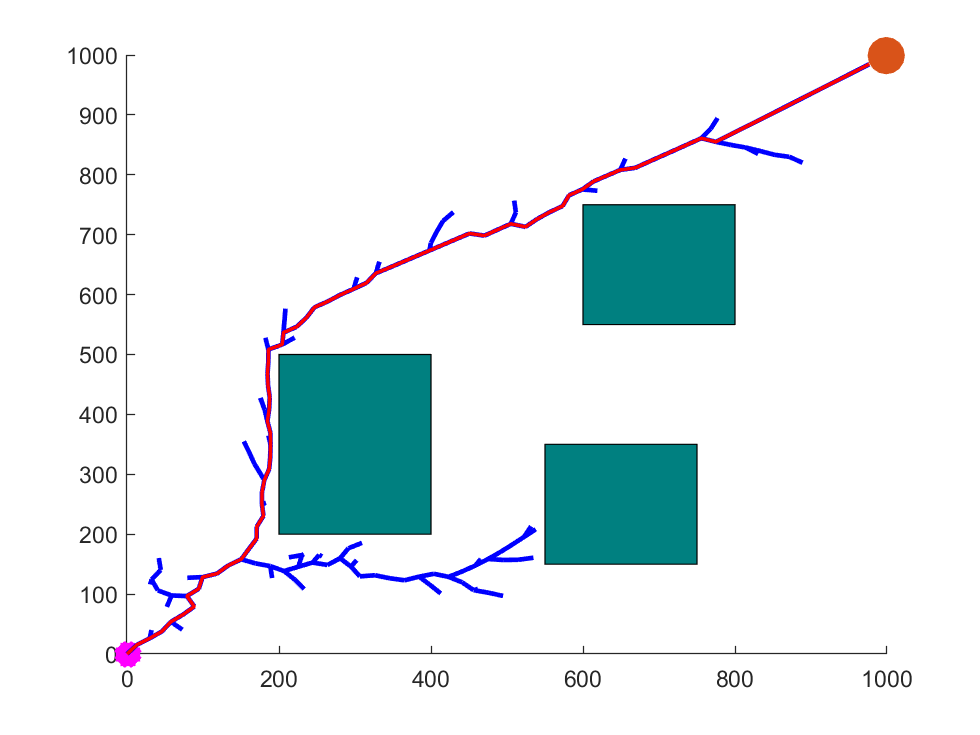

# Description
This is the implementation of the paper:      
**Path Planning Based on Mixed Algorithm of RRT and Artificial Potential Field Method** by Shunyu Huang     
[Paper](https://ieeexplore.ieee.org/document/9570910)  
The algorithm proposed in this paper was based on RRT and RRT* of target bias probability combined with artificial potential field method.
| RRT | RRT star | RRT + APF | RRT star + APF |
| ------------- | ------------- | ------------- | ------------- |
|<br/>|<br/>|<br/>|<br/>

# Citation
Feel free to cite the package if you find it useful for your research.
```
@INPROCEEDINGS{9570910,
  author={Huang, Shunyu},
  booktitle={2021 4th International Conference on Intelligent Robotics and Control Engineering (IRCE)}, 
  title={Path Planning Based on Mixed Algorithm of RRT and Artificial Potential Field Method}, 
  year={2021},
  volume={},
  number={},
  pages={149-155},
  doi={10.1109/IRCE53649.2021.9570910}}
```

